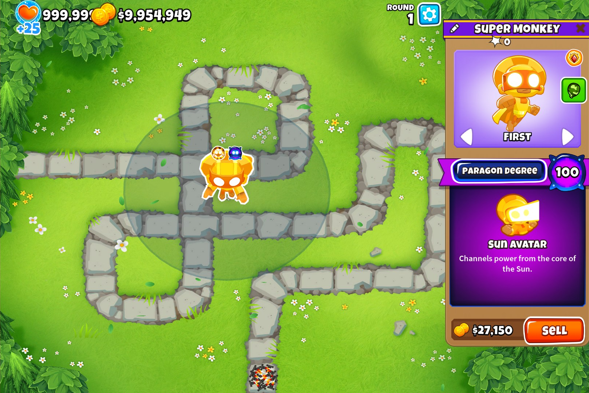
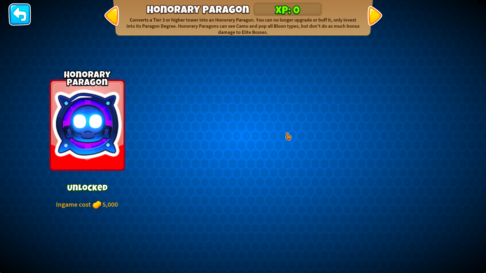

<h1 align="center">

Honorary Paragons
</h1>

<h3 align="center">Adds a custom buff to the shop that turns a regular tier 3+ tower into an Honorary Paragon</h3>

**Requires [Paragonomics](https://github.com/doombubbles/paragonomics#readme)
and [Buffs in Shop](https://github.com/doombubbles/buffs-in-shop#readme)**

You can no longer upgrade or buff an Honorary Paragon, but can invest into its Paragon Degree to increase its power.

Honorary Paragons can see Camo and pop all Bloon types, but don't do as much bonus damage to Elite Bosses.

| Degree | Normal Multiplier | Usual Elite Multiplier | Honorary Elite Multiplier | 
|:------:|:-----------------:|:----------------------:|:-------------------------:|
|  1–19  |        ×1         |           ×2           |            x1             |
| 20–39  |       ×1.25       |          ×2.5          |           x1.5            |
| 40–59  |       ×1.5        |           ×3           |            x2             |
| 60–79  |       ×1.75       |          ×3.5          |           x2.5            |
| 80–99  |        ×2         |           ×4           |            x3             |
|  100   |       ×2.25       |          ×4.5          |           x3.5            |

Additionally, Paragon Degree now affects a tower's cash generation in a few ways

- Direct cash given is increased by the same percentage as damage
- Max number of cash generating emissions each round is increased by the same percentage as attack speed
- Bank interest is increased by the same percentage as attack speed
- Bank capacity increased by the same percentage as pierce

